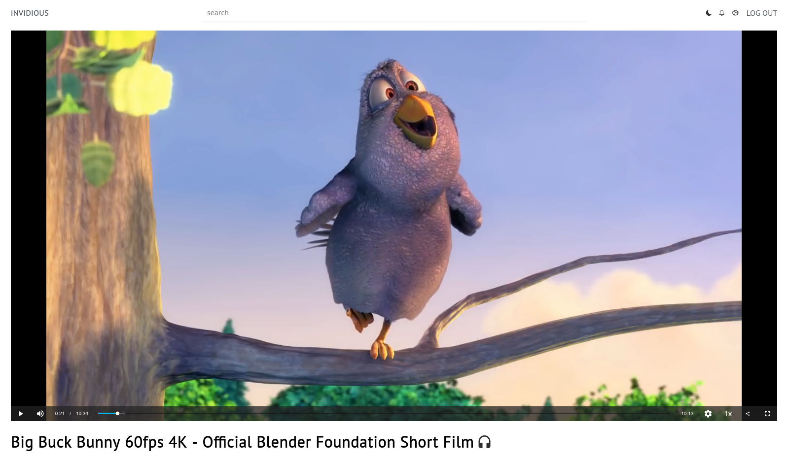
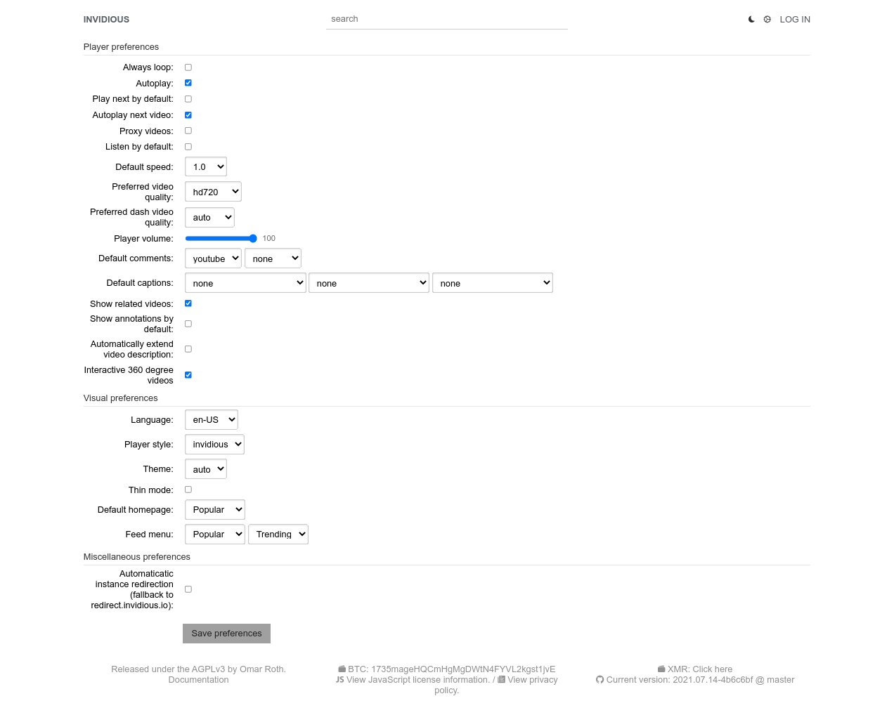
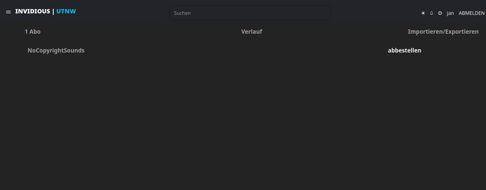
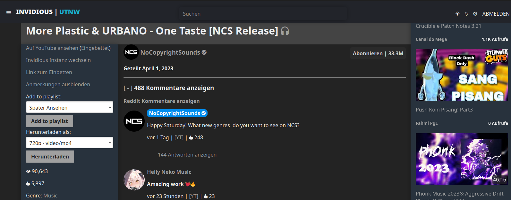
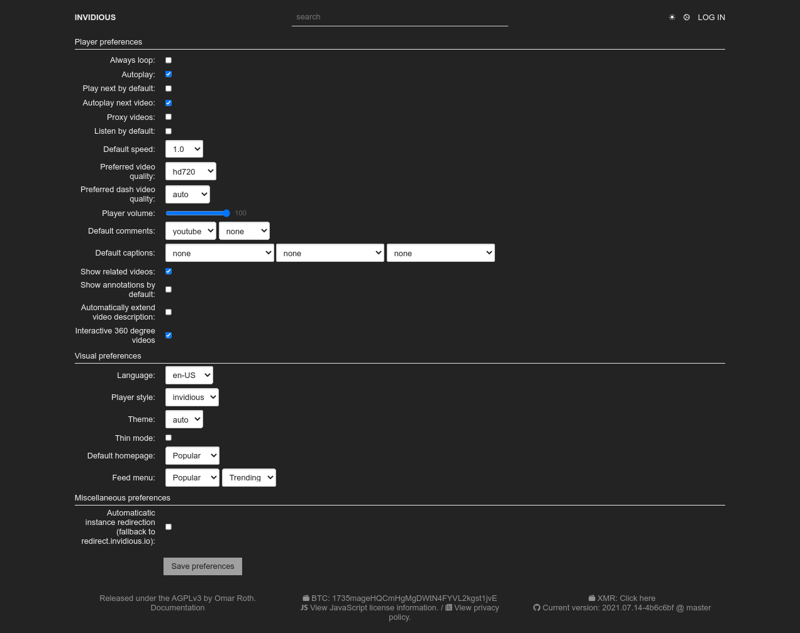
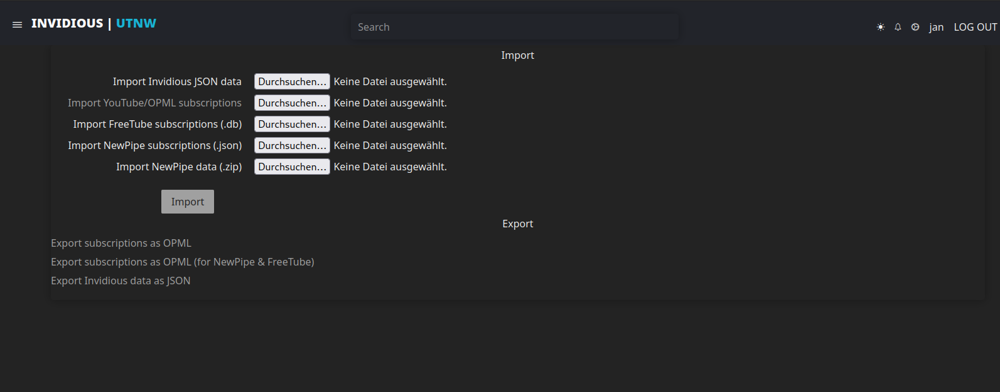

  
  <h1>Invidious</h1>

  
  
  
  
  
  

  

  <h3>An open source alternative front-end to YouTube</h3>

  <a href="https://invidious.io/">Website</a>
  &nbsp;•&nbsp;
  <a href="https://instances.invidious.io/">Instances list</a>
  &nbsp;•&nbsp;
  <a href="https://docs.invidious.io/faq/">FAQ</a>
  &nbsp;•&nbsp;
  <a href="https://docs.invidious.io/">Documentation</a>
  &nbsp;•&nbsp;
  <a href="#contribute">Contribute</a>
  &nbsp;•&nbsp;
  <a href="https://invidious.io/donate/">Donate</a>

  <h5>Chat with us:</h5>
  
  
   
  
   
  

## Screenshots

| Player                              | Preferences                         | Subscriptions                         |
|-------------------------------------|-------------------------------------|---------------------------------------|
|       |  |  |
|  |  |  |

## Features

**User features**
- Lightweight
- No ads
- No tracking
- No JavaScript required
- Light/Dark themes
- Customizable homepage
- Subscriptions independent from Google
- Notifications for all subscribed channels
- Audio-only mode (with background play on mobile)
- Support for Reddit comments
- [Available in many languages](locales/), thanks to [our translators](#contribute)

**Data import/export**
- Import subscriptions from YouTube, NewPipe and Freetube
- Import watch history from NewPipe
- Export subscriptions to NewPipe and Freetube
- Import/Export Invidious user data

**Technical features**
- Embedded video support
- [Developer API](https://docs.invidious.io/api/)
- Does not use official YouTube APIs
- No Contributor License Agreement (CLA)

## Quick start

**Using invidious:**

- [Select a public instance from the list](https://instances.invidious.io) and start watching videos right now!

**Hosting invidious:**

- [Follow the installation instructions](https://docs.invidious.io/installation/)

## Documentation

The full documentation can be accessed online at https://docs.invidious.io/

The documentation's source code is available in this repository:
https://github.com/iv-org/documentation

### Extensions

We highly recommend the use of [Privacy Redirect](https://github.com/SimonBrazell/privacy-redirect#get),
a browser extension that automatically redirects Youtube URLs to any Invidious instance and replaces
embedded youtube videos on other websites with invidious.

The documentation contains a list of browser extensions that we recommended to use along with Invidious.

You can read more here: https://docs.invidious.io/applications/

## Contribute

### Code

1.  Fork it ( https://github.com/iv-org/invidious/fork ).
1.  Create your feature branch (`git checkout -b my-new-feature`).
1.  Stage your files (`git add .`).
1.  Commit your changes (`git commit -am 'Add some feature'`).
1.  Push to the branch (`git push origin my-new-feature`).
1.  Create a new pull request ( https://github.com/iv-org/invidious/compare ).

### Translations

We use [Weblate](https://weblate.org) to manage Invidious translations.

You can suggest new translations and/or correction here: https://hosted.weblate.org/engage/invidious/.

Creating an account is not required, but recommended, especially if you want to contribute regularly.
Weblate also allows you to log-in with major SSO providers like Github, Gitlab, BitBucket, Google, ...

## Projects using Invidious

- [FreeTube](https://github.com/FreeTubeApp/FreeTube): A libre software YouTube app for privacy.
- [CloudTube](https://sr.ht/~cadence/tube/): A JavaScript-rich alternate YouTube player.
- [PeerTubeify](https://gitlab.com/Cha_de_L/peertubeify): On YouTube, displays a link to the same video on PeerTube, if it exists.
- [MusicPiped](https://github.com/deep-gaurav/MusicPiped): A material design music player that streams music from YouTube.
- [HoloPlay](https://github.com/stephane-r/holoplay-wa): Progressive Web App connecting on Invidious API's with search, playlists and favorites.
- [WatchTube](https://github.com/WatchTubeTeam/WatchTube): Powerful YouTube client for Apple Watch.
- [Yattee](https://github.com/yattee/yattee): Alternative YouTube frontend for iPhone, iPad, Mac and Apple TV.
- [TubiTui](https://codeberg.org/777/TubiTui): A lightweight, libre, TUI-based YouTube client.
- [Ytfzf](https://github.com/pystardust/ytfzf): A posix script to find and watch youtube videos from the terminal. (Without API).
- [Playlet](https://github.com/iBicha/playlet): Unofficial Youtube client for Roku TV.
- [Clipious](https://github.com/lamarios/clipious): Unofficial Invidious client for Android.

## Liability

We take no responsibility for the use of our tool, or external instances
provided by third parties. We strongly recommend you abide by the valid
official regulations in your country. Furthermore, we refuse liability
for any inappropriate use of Invidious, such as illegal downloading.
This tool is provided to you in the spirit of free, open software.

You may view the LICENSE in which this software is provided to you [here](./LICENSE).

>   16. Limitation of Liability.
>
> IN NO EVENT UNLESS REQUIRED BY APPLICABLE LAW OR AGREED TO IN WRITING
WILL ANY COPYRIGHT HOLDER, OR ANY OTHER PARTY WHO MODIFIES AND/OR CONVEYS
THE PROGRAM AS PERMITTED ABOVE, BE LIABLE TO YOU FOR DAMAGES, INCLUDING ANY
GENERAL, SPECIAL, INCIDENTAL OR CONSEQUENTIAL DAMAGES ARISING OUT OF THE
USE OR INABILITY TO USE THE PROGRAM (INCLUDING BUT NOT LIMITED TO LOSS OF
DATA OR DATA BEING RENDERED INACCURATE OR LOSSES SUSTAINED BY YOU OR THIRD
PARTIES OR A FAILURE OF THE PROGRAM TO OPERATE WITH ANY OTHER PROGRAMS),
EVEN IF SUCH HOLDER OR OTHER PARTY HAS BEEN ADVISED OF THE POSSIBILITY OF
SUCH DAMAGES.
